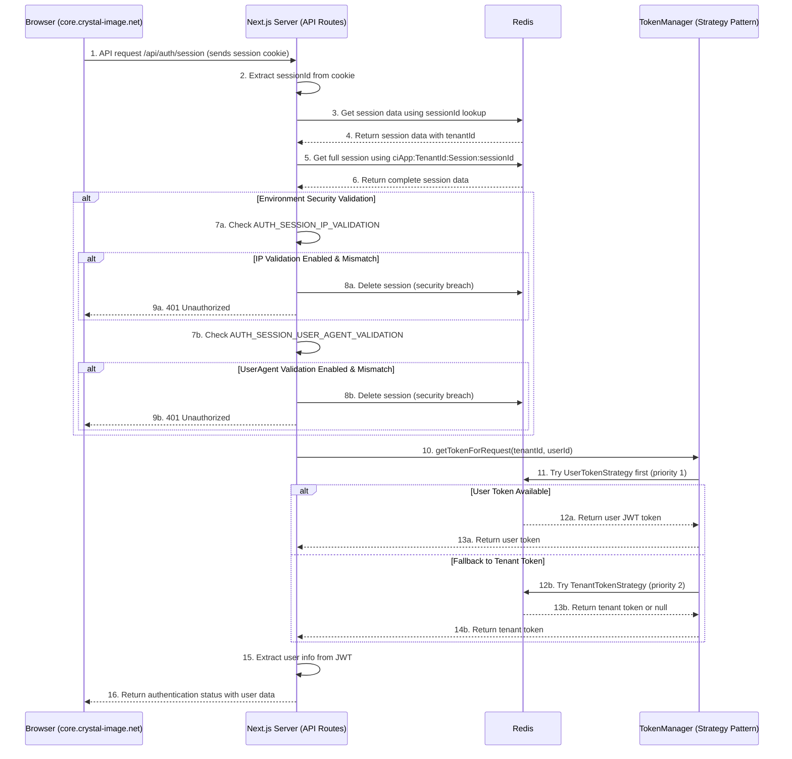
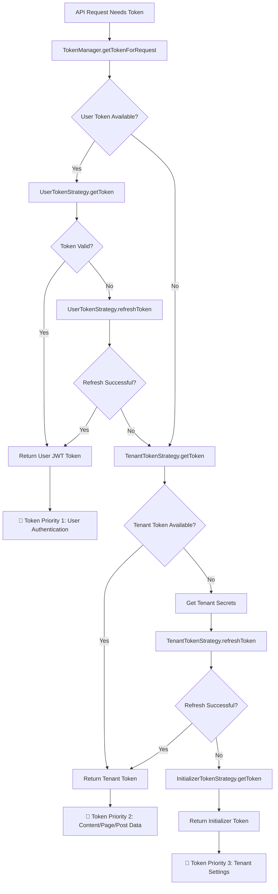

# 🔐 Authentication Module Flow Documentation

## Overview

This document describes the comprehensive authentication flow for the multi-tenant Next.js application after the successful refactoring. The system implements OIDC authentication with PKCE flow, cross-subdomain session sharing, and environment-configurable security.

## Architecture Components

### Core Components
- **AuthProvider**: React context for client-side authentication state
- **API Routes**: Server-side authentication endpoints (`/api/auth/*`)
- **TokenManager**: Strategy pattern implementation for token management
- **SessionManager**: Session creation, validation, and lifecycle management
- **Cookie Utilities**: Cross-subdomain cookie management
- **OIDC Flow**: Authorization code exchange with PKCE security

### Security Features
- PKCE (Proof Key for Code Exchange) implementation
- Environment-configurable IP validation (`AUTH_SESSION_IP_VALIDATION`)
- Environment-configurable UserAgent validation (`AUTH_SESSION_USER_AGENT_VALIDATION`)
- Cross-subdomain cookie sharing with `.crystal-image.net` domain
- JWT tokens for offline verification
- Secure session management with Redis caching

## Authentication Flows

### 1. Initial Login & Session Creation Flow

```mermaid
sequenceDiagram
    actor User
    participant Browser as Browser (Client)
    participant NextApp as Next.js App (React/AuthProvider)
    participant NextServer as Next.js Server (API Routes)
    participant OIDCProvider as OIDC Provider
    participant Redis

    User->>Browser: 1. Access protected route (e.g., core.crystal-image.net/dashboard)
    Browser->>NextApp: Load page
    NextApp->>NextApp: 2. AuthGuard: check AuthProvider state (unauthenticated)
    NextApp-->>Browser: 3. Redirect to /api/auth/login 
    Browser->>NextServer: 4. GET /api/auth/login
    NextServer->>NextServer: 5. Generate PKCE code_verifier & code_challenge
    NextServer->>Redis: 6. Store PKCE data with state key (5min TTL)
    NextServer-->>Browser: 7. Redirect to OIDC Provider w/ params (client_id, code_challenge, etc.)
    Browser->>OIDCProvider: 8. Follow redirect
    OIDCProvider->>User: 9. Prompt for credentials
    User->>OIDCProvider: 10. Submit credentials
    OIDCProvider-->>Browser: 11. Redirect to callback URL w/ authorization_code
    Browser->>NextServer: 12. GET /api/auth/callback?code=...&state=...
    NextServer->>Redis: 13. Retrieve PKCE data using state
    NextServer->>OIDCProvider: 14. Exchange code for tokens (with code_verifier)
    OIDCProvider-->>NextServer: 15. Returns JWTs (ID, Access, Refresh Token)
    NextServer->>NextServer: 16. Extract user info from JWT using extractUserInfoFromJWT
    NextServer->>NextServer: 17. Create session using SessionManager.createSession
    NextServer->>Redis: 18. Store session data (key: ciApp:TenantId:Session:sessionId)
    NextServer->>Redis: 19. Store user tokens (UserTokenStrategy)
    NextServer-->>Browser: 20. Set cross-subdomain session cookie<br/>(Domain=.crystal-image.net; HttpOnly; Secure; SameSite=lax)
    NextServer-->>Browser: 21. Redirect to original protected route
```

### 2. Cross-Subdomain Authentication Validation Flow



### 3. Token Management Strategy Flow



### 4. Logout & Session Cleanup Flow

```mermaid
sequenceDiagram
    participant Browser as Browser (Client)
    participant NextServer as Next.js Server (API Routes)
    participant Redis
    participant OIDCProvider as OIDC Provider

    Browser->>NextServer: 1. POST /api/auth/logout (sends session cookie)
    NextServer->>NextServer: 2. Extract sessionId from cookie
    NextServer->>Redis: 3. Get session data for cleanup context
    NextServer->>Redis: 4. Delete session data (ciApp:TenantId:Session:sessionId)
    NextServer->>Redis: 5. Delete session lookup (SessionLookup:sessionId)
    NextServer->>Redis: 6. Remove from user sessions list
    NextServer->>Redis: 7. Clear user tokens (optional)
    NextServer-->>Browser: 8. Clear session cookie<br/>(Domain=.crystal-image.net; expires=past)
    NextServer-->>Browser: 9. Redirect to OIDC end_session_endpoint
    Browser->>OIDCProvider: 10. Follow redirect for global logout
    OIDCProvider-->>Browser: 11. Redirect to post_logout_redirect_uri (/login)
```

## Key Architecture Features

### Cross-Subdomain Session Sharing
- Session cookie set with `Domain=.crystal-image.net`
- Enables seamless authentication across:
  - `www.crystal-image.net`
  - `core.crystal-image.net`
  - Any other subdomains
- Resolves the original cross-subdomain authentication issue

### Environment-Configurable Security
Configure security vs. usability trade-offs via environment variables:

```bash
# IP Address Validation
AUTH_SESSION_IP_VALIDATION=false  # Recommended for cross-network/mobile users
AUTH_SESSION_IP_VALIDATION=true   # High security, single-location users

# User Agent Validation  
AUTH_SESSION_USER_AGENT_VALIDATION=false  # Flexible user experience
AUTH_SESSION_USER_AGENT_VALIDATION=true   # Strict device binding
```

See [AUTH_SESSION_CONFIG.md](../AUTH_SESSION_CONFIG.md) for detailed configuration guide.

### SOLID Strategy Pattern Implementation

The TokenManager uses the Strategy pattern with three token strategies:

1. **UserTokenStrategy** (Priority 1)
   - Purpose: User authentication
   - Token Type: JWT from OIDC provider
   - Usage: When user is authenticated

2. **TenantTokenStrategy** (Priority 2) 
   - Purpose: Content/Page/Post data access
   - Token Type: Client Credentials token
   - Usage: When accessing tenant-specific content

3. **InitializerTokenStrategy** (Priority 3)
   - Purpose: Tenant settings and configuration
   - Token Type: Global client credentials token
   - Usage: System-level operations

### Redis Cache Key Patterns

The system uses consistent cache key patterns:

```
Sessions:      ciApp:TenantId:Session:sessionId
User Tokens:   ciApp:TenantId:UserToken:userId
Tenant Cache:  ciApp:TenantId:TenantToken:tenantId
Session List:  ciApp:TenantId:UserSessions:userId
Lookups:       SessionLookup:sessionId
PKCE Data:     PKCE:state
```

## API Endpoints

### Authentication Endpoints

- **GET /api/auth/login** - Initiate OIDC login flow
- **GET /api/auth/callback** - Handle OIDC callback with authorization code
- **GET /api/auth/session** - Get current session status
- **POST /api/auth/refresh** - Refresh session expiry
- **POST /api/auth/logout** - Terminate session and logout

### Debug Endpoints

- **GET /api/auth/debug** - Debug authentication state (development only)

## Security Considerations

### PKCE Implementation
- Uses cryptographically secure random generation
- Code verifier: 128 characters from secure charset
- Code challenge: SHA256 hash with base64url encoding
- State parameter: 32 characters secure random

### Session Security
- HttpOnly cookies prevent XSS attacks
- Secure flag for HTTPS-only transmission
- SameSite=lax for cross-site protection
- Domain scoping for subdomain sharing

### Environment Configuration
- IP validation prevents session hijacking but may impact mobile users
- UserAgent validation prevents browser switching but may impact user experience
- Both can be disabled for better UX in trusted environments

## Code Organization

### File Structure
```
libs/auth/
├── components/           # React components (AuthProvider, AuthGuard)
├── core/                # Core authentication functions
│   ├── index.ts         # High-level auth functions
│   ├── sessions.ts      # Session management
│   ├── tokens.ts        # Token utilities
│   ├── cookies.ts       # Cookie utilities
│   └── oidc.ts         # OIDC client functions
├── hooks/               # React hooks for authentication
├── routes/              # API route handlers
├── managers/            # Token management strategies
├── utils/               # Utility functions
│   ├── jwt-utils.ts     # JWT parsing (centralized)
│   └── login-utils.ts   # Login utilities
└── types/               # TypeScript type definitions
```

### Key Design Patterns

1. **Strategy Pattern**: TokenManager with pluggable token strategies
2. **Provider Pattern**: React context for client-side state
3. **Repository Pattern**: Session and token storage abstraction
4. **Factory Pattern**: Session creation with configurable options

## Migration Notes

### Resolved Issues
- ✅ Cross-subdomain authentication working
- ✅ Code duplication eliminated
- ✅ Environment-configurable security
- ✅ SOLID principles implementation
- ✅ Clear separation of client/server code

### Breaking Changes
- Session security validation now configurable via environment variables
- JWT utility functions centralized to eliminate duplication
- Cookie utilities consolidated to single location

## Troubleshooting

### Common Issues

1. **Cross-subdomain authentication not working**
   - Check cookie domain is set to `.crystal-image.net`
   - Verify both apps use same Redis instance
   - Ensure session cookie is HttpOnly and Secure in production

2. **Users getting logged out frequently**
   - Check IP validation settings (`AUTH_SESSION_IP_VALIDATION=false`)
   - Check UserAgent validation (`AUTH_SESSION_USER_AGENT_VALIDATION=false`)
   - Review session timeout settings

3. **Token refresh failures**
   - Verify OIDC provider configuration
   - Check tenant secrets are properly configured
   - Review TokenManager strategy priorities

### Debug Mode
Enable debug logging by checking `/api/auth/debug` endpoint in development.

## Related Documentation

- [AUTH_SESSION_CONFIG.md](../AUTH_SESSION_CONFIG.md) - Environment configuration guide
- [COOKIE-SECURITY.md](../COOKIE-SECURITY.md) - Cookie security details
- [DEBUG.md](../DEBUG.md) - Debugging authentication issues

---

**Last Updated**: Post-refactor completion  
**Status**: ✅ Authentication module refactor successfully completed